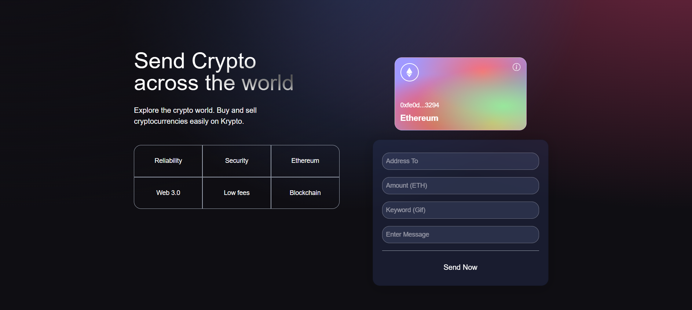
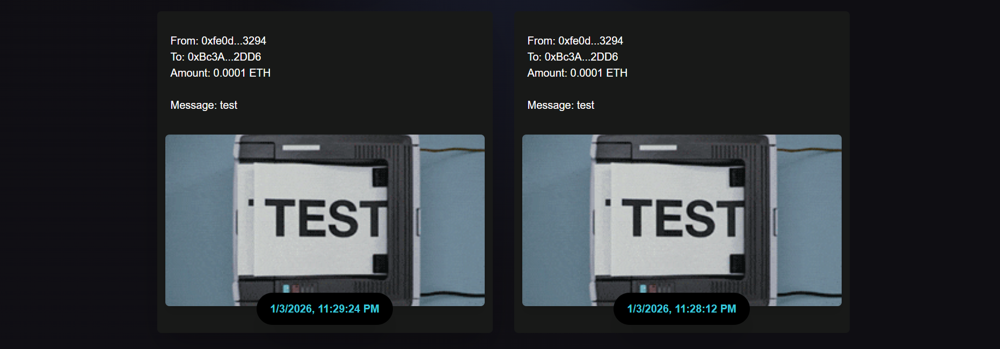

# Whale — Web3 Transactions dApp




A decentralized Web3 application that allows users to connect their MetaMask wallet, send ETH transactions on the Sepolia test network, attach messages and keywords, and view a live on-chain transaction history with dynamic GIF previews.

This project demonstrates the complete Web3 flow:
wallet connection → smart contract interaction → transaction execution → on-chain data retrieval → frontend rendering.

---


## Features

- Connect MetaMask wallet
- Send ETH on Sepolia testnet
- Attach message + keyword to each transaction
- Store transactions on-chain via smart contract
- Fetch and display transaction history
- Latest transactions shown first
- GIFs fetched dynamically using keywords
- Clean responsive UI built with Tailwind CSS
- Ethers.js v6 integration
- React Context for global Web3 state


---

## Tech Stack

**Frontend**
- React
- Vite
- Tailwind CSS
- Ethers.js (v6)

**Blockchain**
- Solidity
- Ethereum Sepolia Testnet
- MetaMask
- Smart Contract deployed on Sepolia
- Hardhat

---

## How Transactions Work

- User connects MetaMask
- User fills in:
- recipient address
- ETH amount
- message
- keyword
- Transaction is signed via MetaMask
- Smart contract stores transaction data
- Frontend fetches and formats transactions
- Latest transactions appear first
- GIFs are fetched using the keyword

## Installation & Setup

### Clone the repository

```bash
git clone https://github.com/your-username/web3-blockchain-anu.git
cd kryptomastery
```

### Install dependencies
```bash
npm install
```

### Run the app

```bash
npm run dev
```


### Open http://localhost:5173 in your browser.